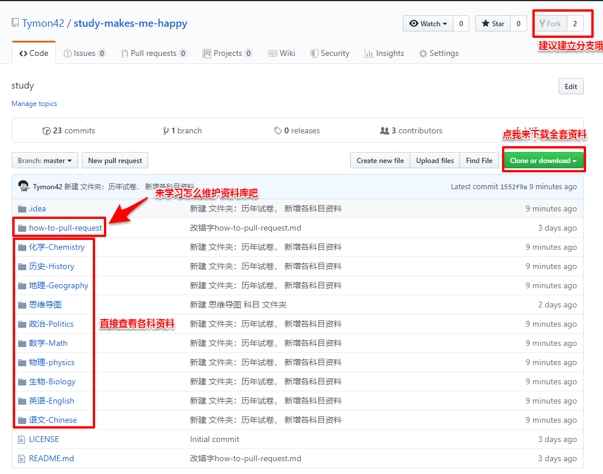

# study-makes-me-happy
>The biggest and evolvable library of high school study material in the world.  
# :sparkles: 学习使我快乐 特点：
> :building_construction: 世界上最大的且可不断进化的高中学习资料库 :tada: 初建于2019.7.17  
:package: 开箱即用  
:zap: 减少你找学习资料的时间，专注学习  

## :memo:来查看[WIKI](https://github.com/Tymon42/study-makes-me-happy/wiki/%E5%AD%A6%E4%B9%A0%E4%BD%BF%E6%88%91%E5%BF%AB%E4%B9%90-study-makes-me-happy)吧

# 门票
>这个资料库是遵循 GNU 开源协议，你可以随意下载使用，但请勿作商业用途。
资料来源为我个人制作、整理，或来源网络，或网友 Pull Request 提供，如有侵权请联系删除。

>但为了资料库继续发展，希望你也可以分享出自己有的资料，或者可以为该资料库内的资料进行勘误。你可以稍微学习一下[怎么 Pull Request](how-to-pull-request/how-to-pull-request.md)来贡献资料或勘误。

>可以先学一下别人有关如[如何 Pull Request](https://github.com/selfteaching/the-craft-of-selfteaching/blob/fe364e73c70204e832223a60fc9a7bf2cb44e7db/02.proof-of-work.ipynb)的教程

>这就是我唯一希望你做的。

# 用法

# 鸣谢
> 技术大触[Cunky](https://www.cunoe.com/)

# 关于馆长
[Tymon42](https://press.one/main/p/d60a0e2c30f65f5d91dc522eedcaf9ca0689c26f) ：
>**地球ol** 萌新玩家

>**Python** 见习玩蛇师
