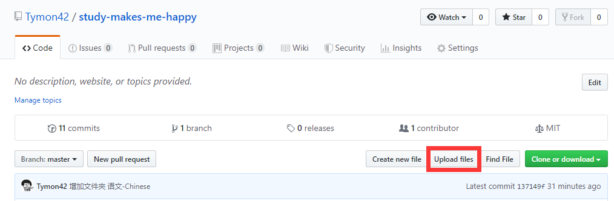

# 赠人玫瑰，手有余香
>人品守恒定理：支出多少，收入多少

## 开始的开始

>1. 注册 github.com 帐号 —— 无论如何你都必须有 github 账户； 
>2. 使用浏览器访问 https://github.com/Tymon42/study-makes-me-happy； 
>3. 在页面右上部找到 “Fork” 按钮，将该仓库 Fork 到你自己的账户中； 
>4. 使用 git clone 命令或者使用 Desktop for Github 将 study-makes-me-happy 这个你 Fork 过来的仓库克隆到本地。 

## 给你一个简单方法贡献资料
1. 使用浏览器访问 https://github.com/Tymon42/study-makes-me-happy ;
2. 上传你的文件:

注意:一定要创建一个新分支，可以取名为 from-<your_username>，或是，by git.basic.tutorial 。

## 如何使用 Pull Request 为资料库贡献或勘误
>1. 使用浏览器访问 https://github.com/Tymon42/study-makes-me-happy； 
>2. 点击右上角的 “Fork 按钮”，将该仓库 Fork 到你的 Github 账户中
>3. 创建一个新分支，可以取名为 from-<your_username>，或是，by git.basic.tutorial；之后点击 Create Branch 建立新分支。
>4. 在新分支下进行修改某个文件，而后提交 —— 提交前不要嫌麻烦，一定要在 Comment 中写清楚修改说明： 
另外，请注意：在创建分支之前，要将你的 Fork 更新到最新版。具体操作方法见下一节《如何在 Github 网站上将自己的 Fork 与原仓库同步》。
>5. 在页面顶部选择 Pull request 标签： 
而后点击 Compare & pull request 按钮 —— 如果看不到这个按钮，那就点击下面刚刚修改文件的链接，如上图中的 “Update README.md”（这是你刚刚提交修改时所填写的标题）。 
确认无误之后，点击 Create pull request 按钮。
>6. 随后，Github 用户 @Tymon42 —— 就是我，即，the-craft-of-selfteaching 这个仓库的所有者，会被通知有人提交了 Pull request，我会看到： 

在我确认这个 Pull request 修改是正确的、可接受的之后，我就会按 Merge pull request 按钮 —— 如此这般，一个修正就由你我共同完成了。 

##### **注意**

提交 Pull request 的时候，最佳策略如下：
>*提交 Pull request 之前，必须先将你的 Fork 的 master 与原仓库同步到最新；
>*从 master 创建 新的 branch 进行增补、修改等操作；
>*尽量每次只提交一个小修改；
>*提交时尽量简短且清楚地说明修改原因；
>*耐心等待回复。 

当自己的 Fork 过来的仓库已经被你在本地 “玩残” 了的时候，它千万不能被当作用来提交 Pull request 的版本。自己本地怎么玩都无所谓，但需要向别人提交 Pull request 的时候，必须重新弄一个当前最新版本到本地，而后再在其基础上修改。

## 如何在 Github 网站上将自己的 Fork 与原仓库同步

(1) 在你的 Fork 页面中，点击 `Compare` 链接：

(2) 将 `base repository` 更改成当前自己的 Fork，

(3) 这时候，页面会显示 `There isn't anything to compare.`，因为你在比较 “自己” 和 “自己”。点击 `compare across forks` 链接，

(4) 将 `head repository` 更改成 Upstream Repository（即，上游仓库），即为 `Tymon42/study-makes-me-happy`，

(5) 稍等片刻，你会看到比较结果；而后你可以创建一个 Pull request —— 这是一个由你自己向你自己的 Fork 仓库提交的 Pull request：

(6) 而后你在 `Pull requests` 标签页里会看到你刚刚提交的 Pull request：

(7) 同意并合并之后的结果是，你的 Fork 与上游仓库同步完成了：

当然，有时会出现一些你无法解决的问题，那么，还有一个最后的方法：

> 将你的 Fork 删除，而后重新到 https://github.com/Tymon42/study-makes-me-happy 页面按一次 `Fork` 按钮……
